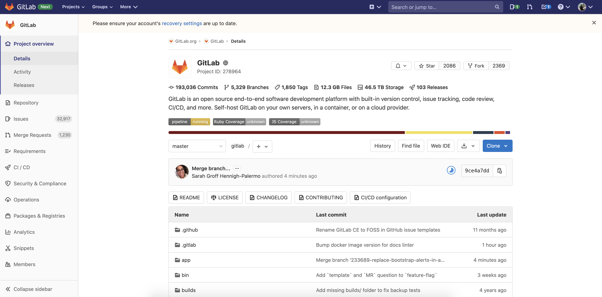
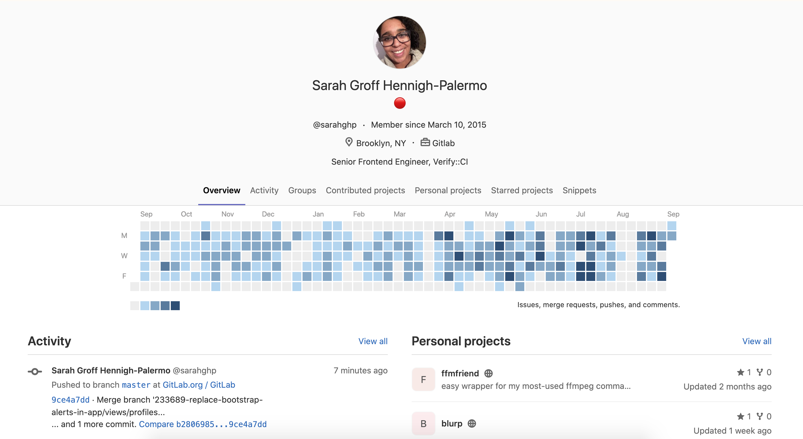

# <small>Коротко обо мне</small>

## Резюме

* Разработчица в ETH Zürich
* Разработчица в Яндекс.Маркете
* Выпускница ШАД
* Выпускница ТПУ

## Мой Open Source

* CatBoost - [github.com/catboost/catboost](https://github.com/catboost/catboost)
* HVL - [gitlab.com/ethz_hvl/hvl_ccb](https://gitlab.com/ethz_hvl/hvl_ccb)
* SCINE Chemoton - [scine.ethz.ch](https://scine.ethz.ch/download/)

# <small>О чем этот доклад?</small>

## Вы узнаете

* Что такое Open Source
* Как присоединится к интересному проекту
* Как создать свой собственный проект
* Какие начать работать в Яндексе/Google не проходя собеседывания?
* Как захоронить свой код в Арктике на 1000 лет

# <small>Что такое Open Source?</small>

## <small>Определение</small>

**Открытое программное обеспечение** (англ. open-source software) — программное обеспечение с открытым исходным кодом. 

## <small>Зачем мне это нужно?</small>

* Вы улучшите программы, которые сами используете
* Вы улучшите свои навыки
* Вы найдете друзей по интересам
* Вы можете найти наставника
* Вы можете начать карьеру
* Вы можете научиться работать в команде
* Это приносит удовольствие и гордость

## <small>Недостатки</small>

# <small>Где найти Open Source проекты?</small>

## github

## github

**GitHub** — крупнейший веб-сервис для хостинга IT-проектов и их совместной разработки. Сервис бесплатен для проектов с открытым исходным кодом и небольших частных проектов.

## github

## github

## gitlab

## gitlab

**GitLab** — веб-инструмент жизненного цикла **DevOps** с открытым исходным кодом, представляющий систему управления репозиториями кода для **Git** с собственной вики, системой отслеживания ошибок, **CI/CD** пайплайном и другими функциями.

## gitlab

## gitlab

## gitlab

* приватные и публичные репозитории бесплатны
* 40 милионов пользователей
* 44 милиона репозиториев
* 

## bitbucket

## bitbucket

## Что выбрать для своего проекта?

# <small>Как устроен Open Source проект?</small>

## tensorflow

## LICENSE

## README

## CONTRIBUTING

## CODE_OF_CONDUCT

## Issues

## Pull requests

## Как это выглядит?

* Create the repository in remote git server
* Initialize the local git repository and add the remote repository URL
* Give access to multiple contributors
* Each contributor can Clone the repository to the local machine
* Pull changes when other contributors update the remote repository
* Push changes to the remote repository
* Reset Back to the commit history as required

# <small>Лицензии</small>

# <small>Кто разрабатывает Open Source?</small>

# <small>Примеры Open Source</small>

# <small>Как присоединиться?</small>

##

* Approach #1: Contribute to something you love
* Approach #2: Specifically seek out beginner-friendly projects
* Approach #3: Stop searching for projects and start searching for bugs.
* Finding good bugs for beginners

A lot of open source projects label their issues to conveniently track them. A lot of projects use labels like beginner, easy, starter, good first bug, low hanging fruit, bitesize, trivial, easy fix, and new contributor.

https://medium.com/free-code-camp/finding-your-first-open-source-project-or-bug-to-work-on-1712f651e5ba

# <small>Как создать что-то свое?</small>

# <small>GitHub Archive Program</small>

##
https://archiveprogram.github.com/

# <small>Ссылки</small>

##

* [https://opensource.guide/](https://opensource.guide/)
* [https://ru.wikipedia.org/](https://ru.wikipedia.org/)