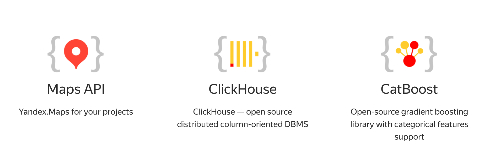
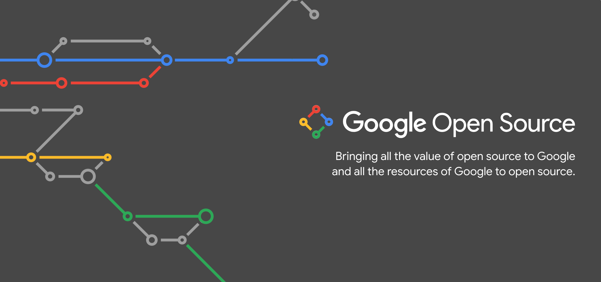
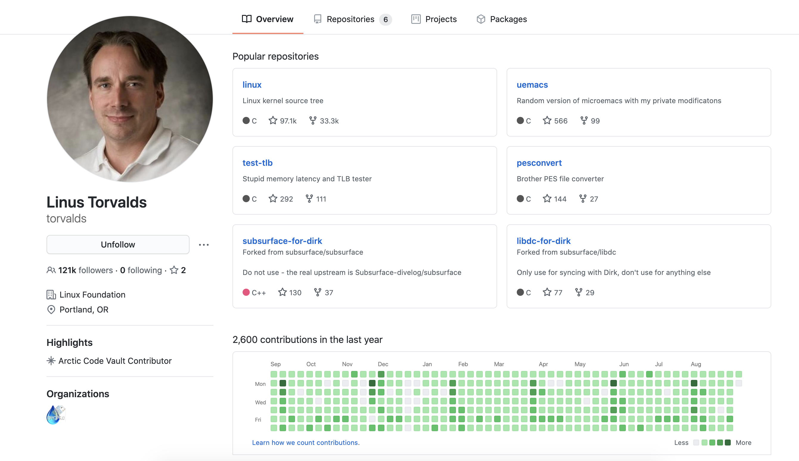
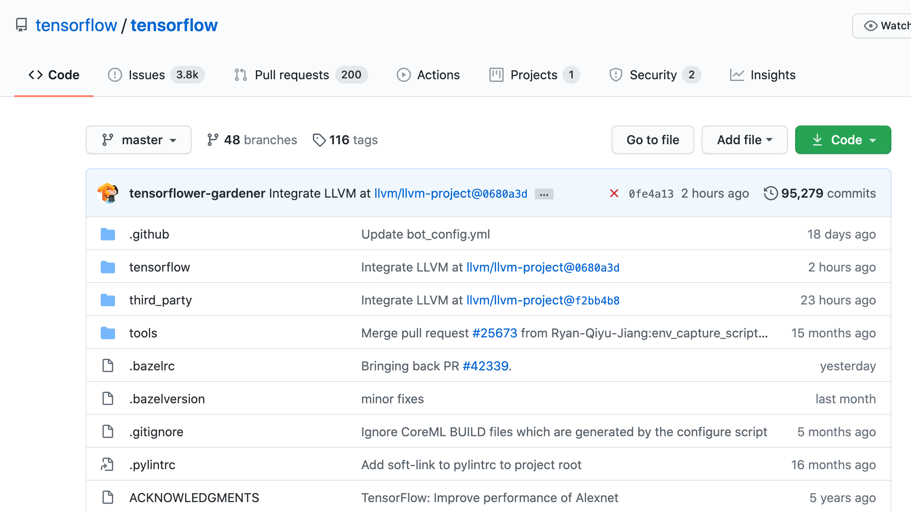
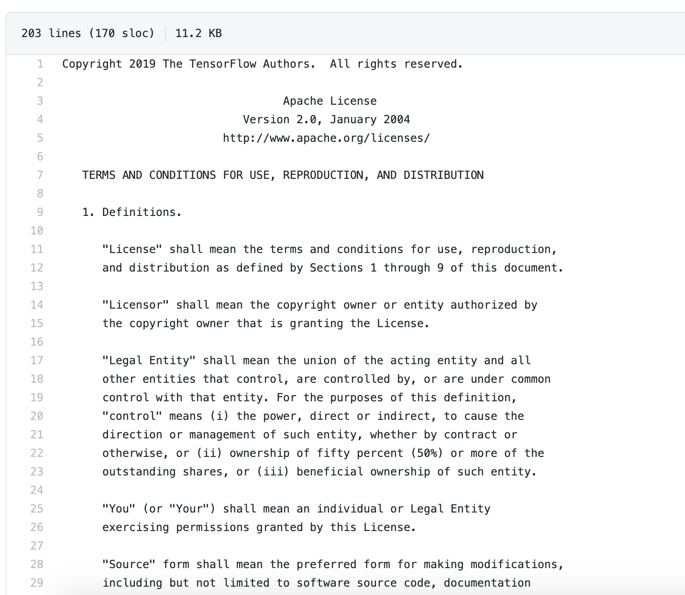
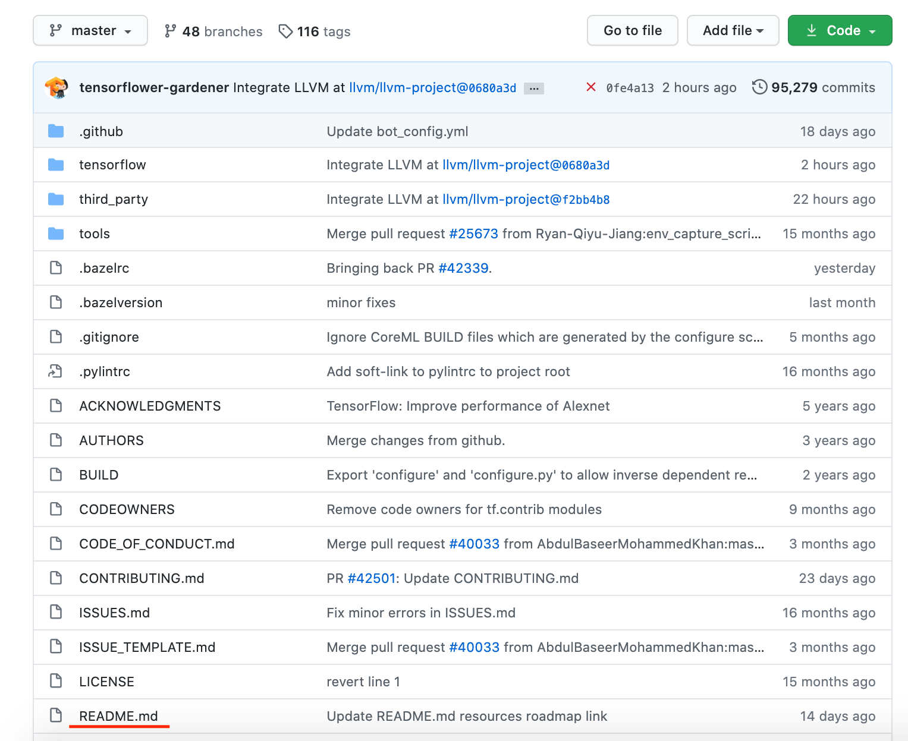
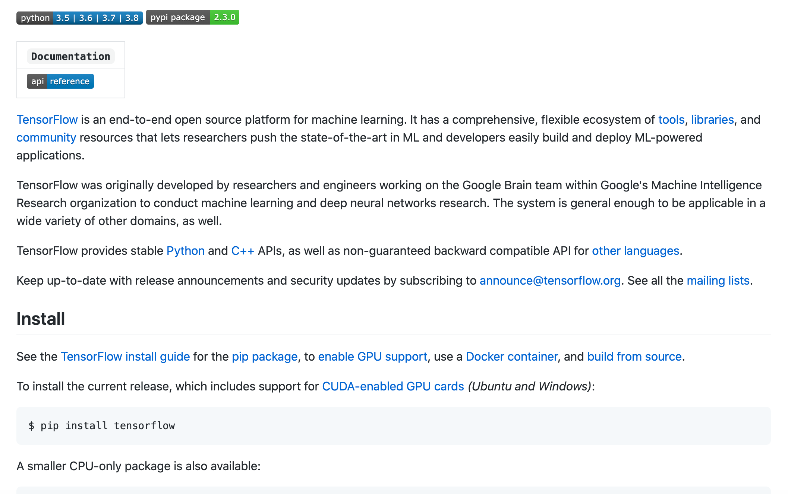
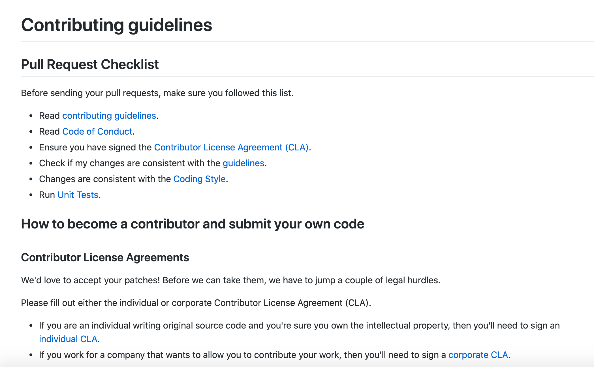
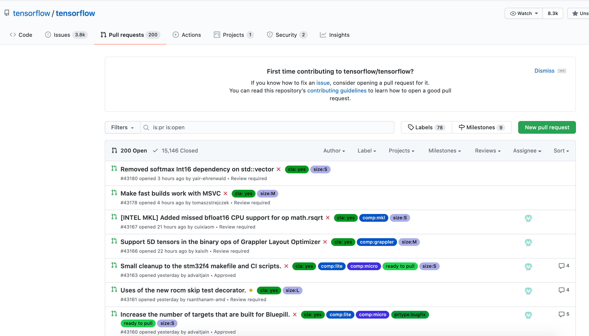
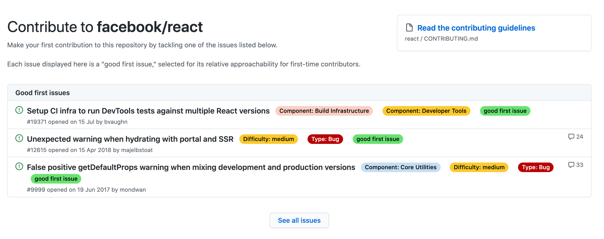

# <small>Коротко обо мне</small>

## Резюме

* Разработчица в ETH Zürich
* Разработчица в Яндекс.Маркете
* Выпускница ШАД
* Выпускница ТПУ

## Мой Open Source

* CatBoost — [github.com/catboost/catboost](https://github.com/catboost/catboost)
* HVL — [gitlab.com/ethz_hvl/hvl_ccb](https://gitlab.com/ethz_hvl/hvl_ccb)
* SCINE Chemoton — [scine.ethz.ch](https://scine.ethz.ch/download/)

# <small>О чем этот доклад?</small>

## Вы узнаете

* Что такое Open Source
* Какие компании разрабатывают Open Source
* Как устроены Open Source проекты
* Как присоединиться к интересному проекту от Яндекса / Google
* Как обнаружить свой код захороненным в Арктике на 1000 лет

# <small>Что такое Open Source?</small>

## <small>Определение</small>

**Открытое программное обеспечение (ПО)** (англ. open-source software) — программное обеспечение с открытым исходным кодом. 

## <small>Исходный код</small>

* доступен для просмотра, изучения и изменения
* можно проверить на наличие уязвимостей
* можно использовать для создания новых программ (если это позволяет лицензия)

## <small>Зачем это нужно компаниям?</small>

* Сотрудничество
* Обратная связь
* Распространение
* Прозрачность

## <small>Зачем это нужно вам?</small>

* Вы улучшите программы, которые сами используете
* Вы можете многому научиться и улучшить свои навыки
* Вы можете начать карьеру
* Вы можете научиться работать в команде
* Вы можете найти друзей или наставника
* Это приносит удовольствие и гордость

## <small>Недостатки</small>

[](pics/net-monet.png)

# <small>Кто разрабатывает Open Source?</small>

## Yandex

[](pics/yandex-dev.png)

[yandex.com/dev](https://yandex.com/dev/)

##

[](pics/catboost.png)

[catboost.ai](https://catboost.ai/)

##

[](pics/ClickHouse.png)

[clickhouse.tech](https://clickhouse.tech/)

## Google

[](pics/opensource_google.png)

[opensource.google](https://opensource.google/)

##

[](pics/tensorflow.png)

[tensorflow.org](https://www.tensorflow.org/)

##

[](pics/go.png)

[golang.org](https://golang.org/)

##

[](pics/chromium.png)

[chromium.org](www.chromium.org)

## Facebook

[](pics/facebook.png)

[opensource.facebook.com](https://opensource.facebook.com/)

##

[](pics/pytorch.jpg)

[pytorch.org](https://pytorch.org/)

##

[](pics/preact.png)

[reactjs.org](https://reactjs.org/)

## Что еще?

* [Linux](github.com/torvalds/linux)
* [Visual Studio Code](github.com/microsoft/vscode)
* [scikit-learn](github.com/scikit-learn)
* [Hadoop](github.com/apache/hadoop)
* [bitcoin](github.com/bitcoin/bitcoin)
* [Swift](github.com/torvalds/linux)

# <small>Где найти Open Source проекты?</small>

## github


## github

**GitHub** — крупнейший веб-сервис для хостинга IT-проектов и их совместной разработки. 

## github

[](pics/linux.png)

## github

[](pics/torvalds.png)

## github

* 50 миллионов пользователей
* 100 миллионов репозиториев
* бесплатные приватные и публичные репозитории
* Continuous Integration (CI)
* Оповещения об уязвимостях в вашем коде
* Поддержка ревью кода
* [подробнее](https://github.com/features)

## gitlab

[](pics/gitlab-logo.png)

## gitlab

**GitLab** — веб-инструмент жизненного цикла **DevOps** с открытым исходным кодом, представляющий систему управления репозиториями кода для **Git**.

## gitlab

[](pics/gitlab.png)

## gitlab

[](pics/sarah.png)

## gitlab

* открытый исходный код
* можно развернуть свой gitlab-сервер
* бесплатные приватные и публичные репозитории
* Continuous Integration (CI)
* Web IDE
* поддержка ревью кода
* продвинутая работа с Issues
* [подробнее](https://about.gitlab.com/stages-devops-lifecycle/)

## bitbucket

[](pics/bitbucket-logo.png)

## bitbucket

[](pics/bitbucket-interface.png)

## bitbucket

* бесплатные приватные и публичные репозитории
* Continuous Integration (CI)
* поддержка ревью кода
* интеграция с Jira
* [подробнее](https://bitbucket.org/product/features)

## Что выбрать для своего проекта?

[](pics/github_vs_gitlab_vs_bitbucket.jpg)

# <small>Анатомия Open Source проекта</small>

## Люди

* Автор
* Владелец
* Maintainers
* Contributors
* Члены сообщества

## tensorflow

[](pics/tensorflow_files.png)

## LICENSE

[](pics/tensorflow_license.png)

## LICENSE

[](pics/tensorflow-apache-license.png)

## README

[](pics/tensorflow_readme.png)

## README

[](pics/tensorflow-open-readme.png)

## CONTRIBUTING

[](pics/tensorflow_contributing.png)

## CONTRIBUTING

[](pics/contributing-guidelines.png)

## CODE_OF_CONDUCT

[](pics/tensorflow_code_of_conduct.png)

## CODE_OF_CONDUCT

[](pics/tensorflow-code-of-conduct.png)

## Issues

[](pics/tensorflow_issues.png)

## Pull requests

[](pics/tensorflow_pulls.png)

# <small>Лицензии</small>

## 

**Лицензии на ПО с открытым исходным кодом** предоставляют любому лицу разрешение на использование, изменение и совместное использование лицензионного программного обеспечения в любых целях при соблюдении условий сохранения происхождения и открытости программного обеспечения.

## Зачем нужна лицензия?

Ваш программный код по умолчанию находится под исключительным авторским правом. Если вы не включаете лицензию, никто другой не может копировать, распространять или изменять вашу работу, не подвергаясь риску изъятия кода или судебного разбирательства. Как только у работы появляются другие авторы, “никто” начинает включать вас.

## Список лицензий

* GNU AGPLv3
* GNU GPLv3
* GNU LGPLv3
* Mozilla Public License 2.0
* Apache License 2.0
* MIT License
* Boost Software License 1.0


## MIT License

```
The MIT License (MIT)
Copyright © 2020 <copyright holders>

Permission is hereby granted, free of charge, to any person obtaining a copy of this software and associated documentation files (the “Software”), to deal in the Software without restriction, including without limitation the rights to use, copy, modify, merge, publish, distribute, sublicense, and/or sell copies of the Software, and to permit persons to whom the Software is furnished to do so, subject to the following conditions:

The above copyright notice and this permission notice shall be included in all copies or substantial portions of the Software.

THE SOFTWARE IS PROVIDED “AS IS”, WITHOUT WARRANTY OF ANY KIND, EXPRESS OR IMPLIED, INCLUDING BUT NOT LIMITED TO THE WARRANTIES OF MERCHANTABILITY, FITNESS FOR A PARTICULAR PURPOSE AND NONINFRINGEMENT. IN NO EVENT SHALL THE AUTHORS OR COPYRIGHT HOLDERS BE LIABLE FOR ANY CLAIM, DAMAGES OR OTHER LIABILITY, WHETHER IN AN ACTION OF CONTRACT, TORT OR OTHERWISE, ARISING FROM, OUT OF OR IN CONNECTION WITH THE SOFTWARE OR THE USE OR OTHER DEALINGS IN THE SOFTWARE.
```

## MIT License

Короткая и простая разрешительная лицензия с условиями, требующими только сохранения авторских прав и лицензионных уведомлений. 

## MIT License

* код можно использованы в коммерческих целях
* код может быть изменен и распространен
* Лицензия не предоставляет никаких гарантий
* Лицензия включает ограничение ответственности
* Уведомление об авторских правах

## Apache License 2.0

```
                                 Apache License
                           Version 2.0, January 2004
                        http://www.apache.org/licenses/

   TERMS AND CONDITIONS FOR USE, REPRODUCTION, AND DISTRIBUTION

   1. Definitions.

      "License" shall mean the terms and conditions for use, reproduction,
      and distribution as defined by Sections 1 through 9 of this document.

      "Licensor" shall mean the copyright owner or entity authorized by
      the copyright owner that is granting the License.

      "Legal Entity" shall mean the union of the acting entity and all
      other entities that control, are controlled by, or are under common
      control with that entity. For the purposes of this definition,
      "control" means (i) the power, direct or indirect, to cause the
      direction or management of such entity, whether by contract or
      otherwise, or (ii) ownership of fifty percent (50%) or more of the
      outstanding shares, or (iii) beneficial ownership of such entity.

      "You" (or "Your") shall mean an individual or Legal Entity
      exercising permissions granted by this License.

      "Source" form shall mean the preferred form for making modifications,
      including but not limited to software source code, documentation
      source, and configuration files.
...
more - https://choosealicense.com/licenses/apache-2.0/
```

## Apache License 2.0

Разрешительная лицензия, основные условия которой требуют сохранения авторских прав и лицензионных уведомлений.

## Apache License 2.0

* MIT License
* Не предоставляет прав на товарные знаки
* Предоставление патентных прав от участников проекта
* Изменения должны быть задокументированы

## GNU GPLv3

```
          GNU GENERAL PUBLIC LICENSE
                       Version 3, 29 June 2007

 Copyright (C) 2007 Free Software Foundation, Inc. <https://fsf.org/>
 Everyone is permitted to copy and distribute verbatim copies
 of this license document, but changing it is not allowed.

                            Preamble

  The GNU General Public License is a free, copyleft license for
software and other kinds of works.

  The licenses for most software and other practical works are designed
to take away your freedom to share and change the works.  By contrast,
the GNU General Public License is intended to guarantee your freedom to
share and change all versions of a program--to make sure it remains free
software for all its users.  We, the Free Software Foundation, use the
GNU General Public License for most of our software; it applies also to
any other work released this way by its authors.  You can apply it to
your programs, too.
...
more - https://choosealicense.com/licenses/gpl-3.0/
```

## GNU GPLv3

GPLv3 — одна из самых строгих лицензий. Она обеспечивает высокую степень защиты для автора программного обеспечения.

## GNU GPLv3

* Apache License 2.0 ( - товарные знаки)
* Изменения должны быть выпущены под той же лицензией
* Исходный код должен быть доступен

## <small>Какую лицензию выбрать?</small>

[](pics/сhoose_license.png)

# <small>Вы решились! С чего начать?</small>

##

* начните с того, что вам нравится
* можно начать с поиска опечаток
* ищите дружелюбные проекты для начинающих
* не ищите проекты, ищите баги

## Issue label

[](pics/beginner.png)

* <span style="color: red;">beginner</span>, <span style="color: MAROON;">easy</span>, <span style="color: LIME;">starter</span>, <span style="color: GREEN;">good first bug</span>
* <span style="color: BLUE;">low hanging fruit</span>, <span style="color: SILVER;">bitesize</span>, <span style="color: TEAL;">trivial</span>
* <span style="color: PURPLE;">easy fix</span>, and <span style="color: NAVY;">new contributor</span>

##

[](pics/tensorflow_contribute.png)

[github.com/tensorflow/tensorflow/contribute](https://github.com/tensorflow/tensorflow/contribute)

##

[](pics/react-contribute.png)

[github.com/facebook/react/contribute](https://github.com/facebook/react/contribute)

## <small>Прежде чем начать</small>

Важно понять активность проекта:

* есть ли лицензия
* когда был последний коммит
* размер команды
* количество открытых задач
* скорость ответа на вопросы

# <small>GitHub Archive Program</small>

##

[](pics/arctic.jpg)

[archiveprogram.github.com](https://archiveprogram.github.com/)

## The GitHub Arctic Code Vault

GitHub Arctic Code Vault — это хранилище данных, хранящееся на глубине 250 метров в вечной мерзлоте Арктической горы. Архив находится в списанной угольной шахте на архипелаге Шпицберген. GitHub сделает снимок каждого активного публичного репозитория 02.02.2020 года и сохранит эти данные в Arctic Code Vault.

# <small>Ссылки</small>

## <small>Ссылка на презентацию</small>

[github.com/pukhlyakova/openSourcePresentation](https://github.com/pukhlyakova/openSourcePresentation)


## <small>Этой презентации не было бы без Open Source</small>

* [reveal.js](https://github.com/hakimel/reveal.js/)
* [pandoc](https://github.com/jgm/pandoc)


##
* [Список Open Source](https://github.com/pukhlyakova/openSourcePresentation/blob/master/open_source_list.md)
* [Список источников](https://github.com/pukhlyakova/openSourcePresentation/blob/master/links.md)